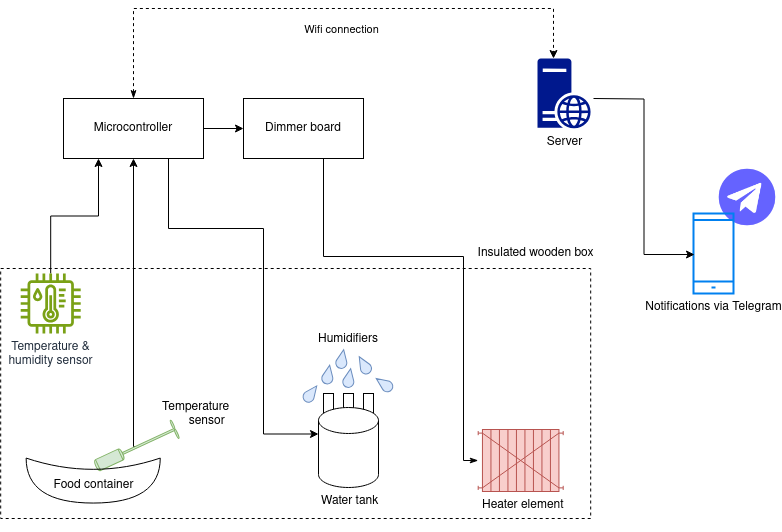
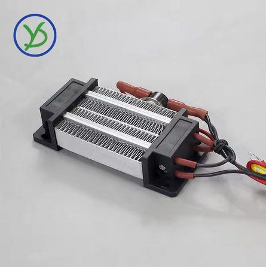

# SmartFermentationChamber

This is a SW + HW + woodworking project to create an insulated chambed with highly regulated temperature and humidity to perform food fermentation. This project is currently work-in-progress, please check the [TODOs](#todo) before trying to replicate this.

## Table of contents
- [Table of contents](#table-of-contents)
- [Architecture](#architecture)
- [Firmware](#firmware)
- [PCB](#pcb)
- [Bill of materials](#bill-of-materials)
  - [Main components](#main-components)
  - [PCB parts](#pcb-parts)
- [Pictures](#pictures)
  - [Box](#box)
  - [Web server graphs](#web-server-graphs)
  - [ESP Web UI](#esp-web-ui)
- [TODOs](#todos)

## Architecture

The ESP32 gathers environmental data through sensors, evaluates it against target values, and manages the heater and humidifiers accordingly. This data is logged to a Python controller via MQTT, which generates graphs viewable through a web server. The ESP32 is configurable via a built-in web interface powered by [ESPUI](https://github.com/s00500/ESPUI). Additionally, the controller can send real-time alerts to a smartphone using the Telegram API. An optional 230V dimmer is available to regulate the heater's current based on the size of the heated space.

<picture>
    <source srcset="doc/architecture_dark.png"  media="(prefers-color-scheme: dark)">
    
</picture>

## Firmware

It is a PlatformIO project. There is a [bug](https://github.com/lorol/LITTLEFS/pull/56
) in the external littlefs library, I had to fix it manually to get the FW compiling. The [fix](https://github.com/lorol/LITTLEFS/issues/43#issuecomment-1763347319
) is very easy to do.

## PCB

This is my first-ever PCB design, created in KiCad and manufactured by JLCPCB. Most of the routing was done using the auto-router, so please go easy on me. I made some mistakes, most notably I used an incorrect ESP devboard, these were fixed in 2.2, however I have not ordered those.

## Bill of materials

Prices are for one working unit with shipping, the date of prices is 2025.01. 
I ordered my parts from [Hestore](http://hestore.hu), if anyone needs to look up part numbers.

### Main components
|Name  |Link|Price |Description         |
|----------|-----|----|----------|
|*220V 300W Incubator heater Insulation-Thermostatic PTC ceramic air heater * | https://www.aliexpress.com/item/1005007503406690.html | 12 euro | You should buy one with a fan, I added one externally!  |
|*DC 5V Switchable Four Spray Humidifier Module Atomization Control Board DIY Ultrasonic Atomizer* | https://www.aliexpress.com/item/1005007493271175.html | 6 euro | Make sure to order one without a button, which powers on right after voltage is present |
| ESP32-WROOM development board | https://www.aliexpress.com/w/wholesale-esp32%2525252dwroom%2525252d32.html | 6 euro | I used USB-C with ESP32-WROOM-32D chip, but I dont think this really matters | 
| PCB parts | - | 17 euro | *see BOM below* |
| PCB itself | https://jlcpcb.com/ | 22 euro *(for minimum order of 5 boards)* | I am not providing Gerber files, you will have to check the board/modify it if you need something, and just create the ZIP for yourself in KiCad!
| Wood + insulation | your local hardware store | max 20 euro | I don't remember the exact price
| *2000/4000W High Power Thyristor Electronic Voltage AC 220V Regulator Dimming Speed Temperature Regulation control switch* | https://www.aliexpress.com/item/1005006015316145.html | 5 euro |  |
| BME280 sensor | https://www.aliexpress.com/w/wholesale-bme280-sensor.html | 4 euro |  |
| Waterproof DS18B20 Temperature Sensor | https://www.aliexpress.com/item/1005001601986600.html | 4 euro | |
| **Total** | - | **~100 euro** | + cables, wires and misc soldering stuff |

### PCB parts

|Quantity  |Item name|Description         |
|----------|---------|--------------------|
|6         |1000 uF / 35V|Capacitor 12.5mm/5mm       |
|5         |LED 5 mm D-RD|LED                 |
|2         |1N4007   |Diode               |
|1         |68 R   |Resistor            |
|4         |220 R  |Resistor            |
|2         |680 R  |Resistor            |
|1         |4,7 K  |Resistor            |
|1         |10 K   |Resistor            |
|1         |2SD1207  |NPN transistor      |
|1         |BAT85    |Schottky-diode      |
|3         |1 K    |Resistor            |
|3         |ZL262-20SG|Pin header          |
|1         |IRLZ44NPBF|FET N               |
|1         |SRD-5VDC-SL-C|Relay, SPDT, 5V DC, 10A / 250V AC|
|1         |SFH610A-1|Optocoupler         |
|1         |330uH / 1.2A / 630mR|Inductor            |
|1         |PTF/78   |Fuse holder, socket, 5x20mm|
|1         |BS232    |Fuse holder cover   |
|3         | ? |PCB terminal block, 90 degrees, 0.5cm, 2-pole|
|1         | ? |PCB terminal block, 90 degrees, 0.5cm, 4-pole|
|3         | ?|PCB terminal block, 90 degrees, 0.5cm, 3-pole|
|1         |XL2576S-5.0E1|Voltage stabilizer IC, both TO220 and TO263 fit |
|3         |5X20-F-3A|Fuse, fusible, glass, fast, 5x20mm, 250V AC, 3A|

## Pictures

### Box
*(before the PCB was created)*

### Web server graphs
Graphs 

### ESP Web UI

## TODOs
- docs
  - add new render of PCB after fixing everything
- PCB
  - change ESP board to ESP-WROOM-32-ESP32S
  - double led resistor values
  - add diode between 5v and reg ic, feedback pin needs to be appriopriate position
  - label gnd' to gnd switched
  - dallas data pullup fix
  - add PCB holes for mounting
  - remove non existing 5v ic resistors from BOM
  - octocoupler goes to 3v3 not 5v (??? untested)